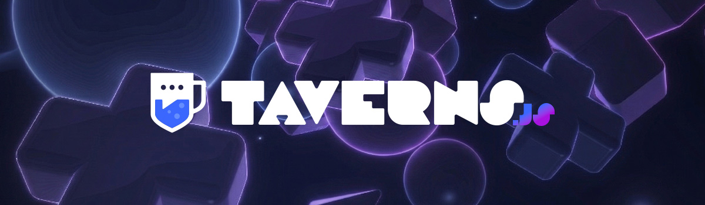

<p align="center">
  
</p>

# taverns.js

SDK for building Tavern bots for the [Taverns](https://tav.gg) platform.

## Installation

```bash
npm install taverns.js
```

## Quick Start

```typescript
import { Client } from 'taverns.js';

const client = new Client({ token: 'tavbot_your_token_here' });

client.on('ready', () => {
  console.log(`Logged in as ${client.user.displayName}`);
  console.log(`Connected to ${client.taverns.size} tavern(s)`);
});

client.on('messageCreate', async (message) => {
  // Ignore messages from bots (including self)
  if (message.sender.id === client.user.id) return;

  if (message.content === '!ping') {
    await message.reply('Pong!');
  }

  if (message.content === '!info') {
    const tavern = client.taverns.get(message.tavernId);
    await message.reply(`This tavern is "${tavern?.name}" with ${tavern?.memberCount} members.`);
  }
});

client.on('memberJoin', (event) => {
  console.log(`${event.displayName} joined tavern ${event.tavernId}`);
});

client.on('error', (error) => {
  console.error('Client error:', error);
});

client.login();
```

## Features

- **Familiar API** - Client, Collection, PermissionsBitField
- **Auto-reconnect** - Exponential backoff with jitter on disconnect
- **Rate limiting** - Automatic handling of API rate limits with retries
- **Type-safe** - Full TypeScript support with type-safe event emitter
- **Caching** - Taverns, channels, and members cached automatically
- **Message helpers** - `message.reply()`, `message.edit()`, `message.delete()`, `message.react()`

## Core Concepts

### Client

The main class. Manages the WebSocket connection, caches, and provides convenience methods.

```typescript
const client = new Client({
  token: 'tavbot_...',        // Required (or pass to login())
  apiUrl: '...',               // Override REST API URL
  wsUrl: '...',                // Override WebSocket URL
  autoReconnect: true,         // Auto-reconnect on disconnect
  maxReconnectAttempts: 10,    // Give up after N attempts
  heartbeatInterval: 30000,    // Heartbeat interval (ms)
});

await client.login();
```

### Events

```typescript
// Lifecycle
client.on('ready', () => { ... });
client.on('disconnected', (code, reason) => { ... });
client.on('reconnecting', (attempt) => { ... });
client.on('error', (error) => { ... });
client.on('debug', (message) => { ... });

// Messages
client.on('messageCreate', (message) => { ... });
client.on('messageUpdate', (event) => { ... });
client.on('messageDelete', (event) => { ... });
client.on('messageDeleteBulk', (event) => { ... });

// Members
client.on('memberJoin', (event) => { ... });
client.on('memberLeave', (event) => { ... });

// Channels
client.on('channelCreate', (channel) => { ... });
client.on('channelUpdate', (event) => { ... });
client.on('channelDelete', (event) => { ... });

// Roles
client.on('roleUpdate', (role) => { ... });
client.on('roleDelete', (event) => { ... });

// Bot lifecycle
client.on('botInstalled', (event) => { ... });
client.on('botRemoved', (event) => { ... });

// Raw gateway events
client.on('raw', (eventName, data) => { ... });
```

### Permissions

```typescript
import { PermissionsBitField } from 'taverns.js';

const perms = new PermissionsBitField(tavern.grantedPermissions);

if (perms.has('SEND_MESSAGES')) {
  // Bot can send messages
}

if (perms.has('ADMINISTRATOR')) {
  // Bot has full admin access
}

console.log(perms.toArray());
// ['VIEW_CHANNELS', 'SEND_MESSAGES', 'READ_MESSAGE_HISTORY', ...]
```

### Collections

```typescript
// Taverns collection (extends Map)
const tavern = client.taverns.find(t => t.name === 'My Tavern');
const textChannels = client.channels.filter(c => c.type === 'TEXT');
const firstTavern = client.taverns.first();
const names = client.taverns.map(t => t.name);
```

### REST API

For advanced use, access the REST client directly:

```typescript
// Direct REST calls
const channels = await client.rest.getChannels(tavernId);
const members = await client.rest.getMembers(tavernId);
const message = await client.rest.sendMessage(tavernId, channelId, {
  content: 'Hello!',
});
```

## Bot Token

Bot tokens start with `tavbot_` and are generated in the Taverns developer portal. Never commit your token to source control.

```typescript
// Use environment variables
const client = new Client({ token: process.env.TAVERN_BOT_TOKEN });
```

## API Reference

### Client Methods

| Method | Description |
|---|---|
| `login(token?)` | Connect and authenticate |
| `destroy()` | Disconnect and clean up |
| `sendMessage(tavernId, channelId, options)` | Send a message |
| `editMessage(tavernId, messageId, options)` | Edit a message |
| `deleteMessage(tavernId, messageId)` | Delete a message |
| `getMessages(tavernId, channelId, options?)` | Fetch messages |
| `createChannel(tavernId, options)` | Create a channel |
| `updateChannel(tavernId, channelId, options)` | Update a channel |
| `deleteChannel(tavernId, channelId)` | Delete a channel |
| `getMembers(tavernId, options?)` | List tavern members |
| `getMember(tavernId, userId)` | Get a specific member |

### ActionableMessage Methods

Messages received via `messageCreate` have these helper methods:

| Method | Description |
|---|---|
| `message.reply(content)` | Reply to the message |
| `message.edit(content)` | Edit the message |
| `message.delete()` | Delete the message |
| `message.pin()` | Pin the message |
| `message.unpin()` | Unpin the message |
| `message.react(emoji)` | Add a reaction |

## Links

- [npm package](https://www.npmjs.com/package/taverns.js)
- [API Documentation](https://tav.gg/developers/docs)
- [Developer Portal](https://tav.gg/developers/home)
- [taverns.py](https://github.com/Tav-gg/taverns.py) (Python SDK)

## License

Apache-2.0 - see [LICENSE](LICENSE) for details.
